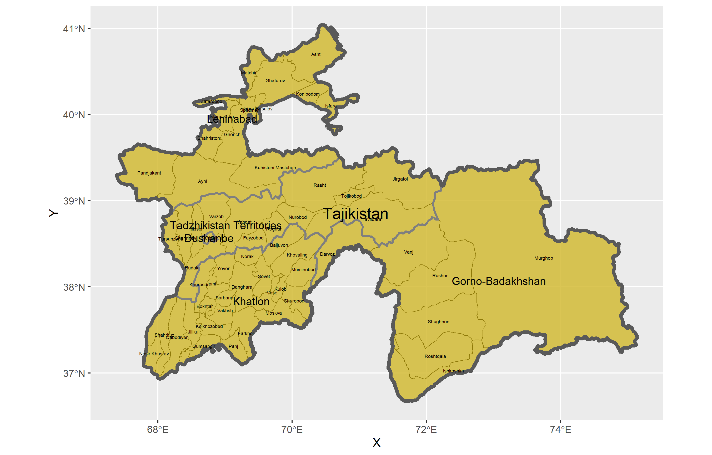
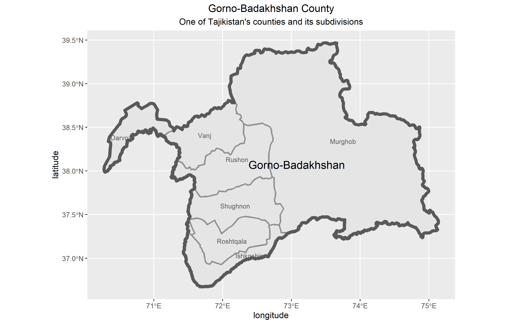

# Project 1
In this project, we learned how to label administrative subdivisions of a country and plotting boundaries. 

I chose to investigate Tajikistan, and this was the first map created for the challenge question.

Then for Stretch Goal 2, I created a map of Gorno-Badakhshan County, one of Tajikistan's administrative subdivisions

