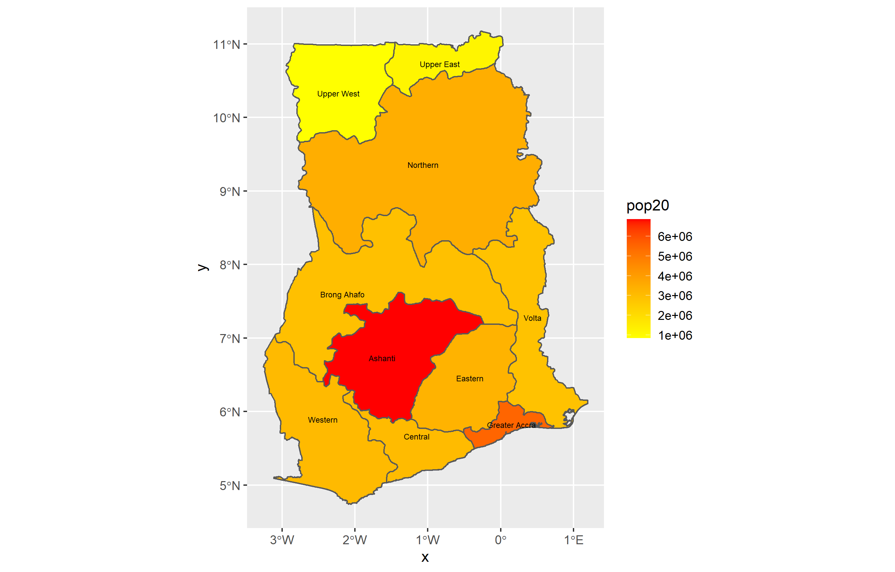

# Project 2.1

In this project, we learned how to extract populations from a raster and aggregating them to a unit. 

# Challenge Problem
This is the population plot of the first administrative districts of Ghana 

# Stretch Goal 1
This is the plot of the second administrative districts of Ghana plotting the log of the population

# Stretch Goal 2
This is the plot from Stretch Goal 1 with the first administrative boundaries

# Stretch Goal 3
This is the 3D plot created based on the log of the population of Ghana

