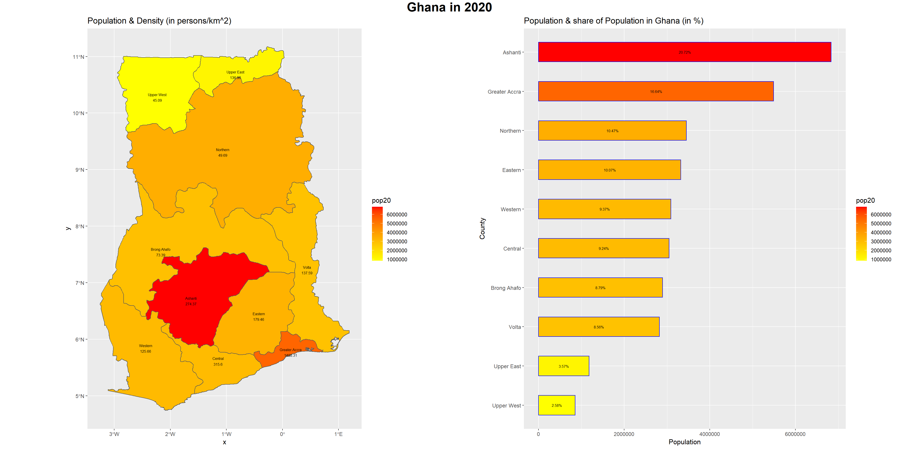
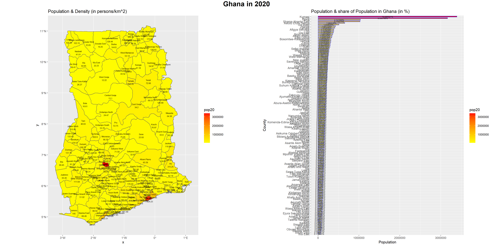
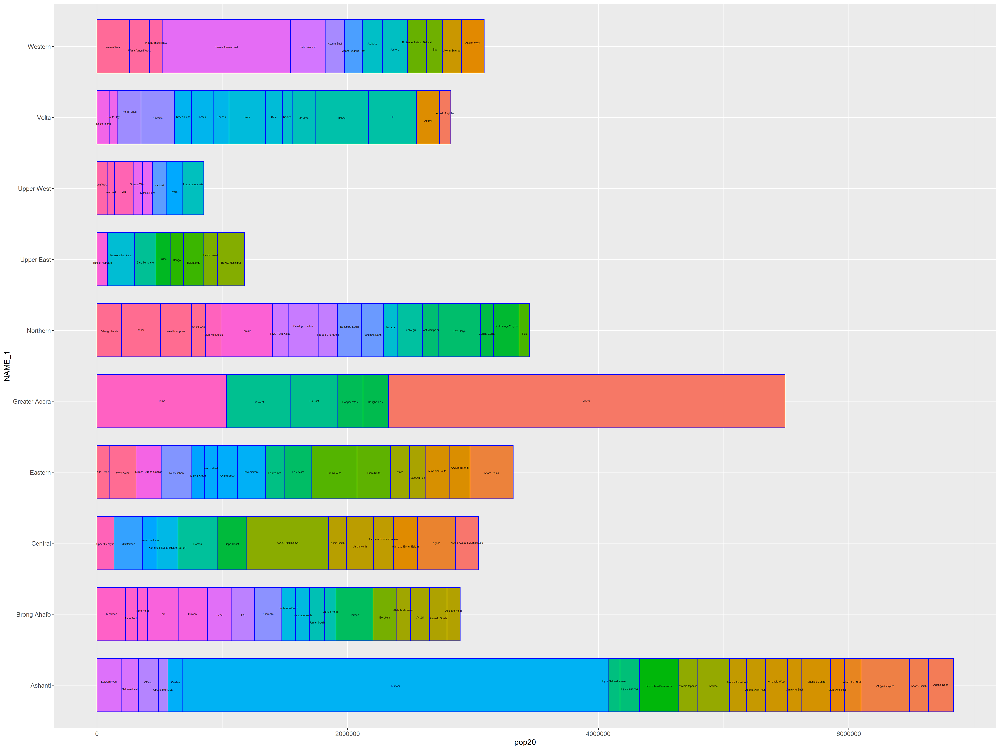

# Project 2.2

In this project, we created bar plots based on our simple feature objects.

# Challenge Problem
This is the geometric bar plot and spatial description of the first administrative districts of Ghana based on the population data.

# Stretch Goal 1
This is the geometric bar plot and spatial description of the second administrative districts of Ghana based on the population data. 

This is the subsequent geometric bar plot of the second administrative districts of Ghana.

