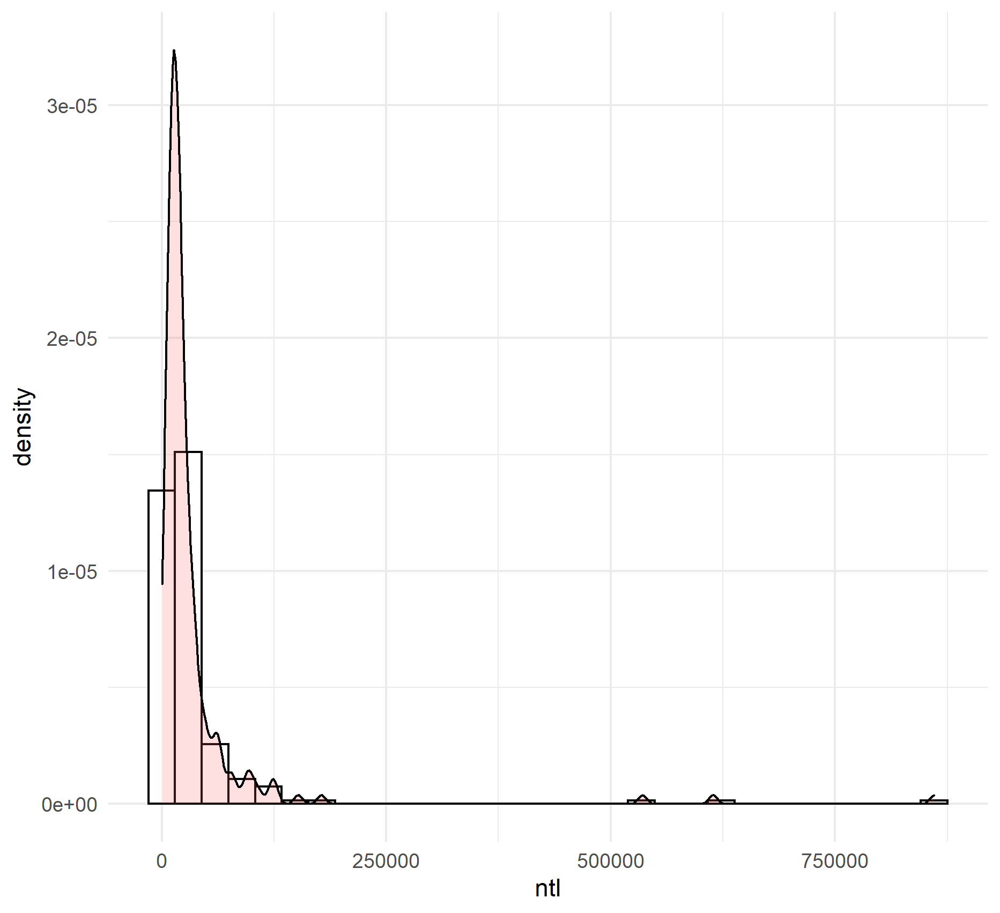
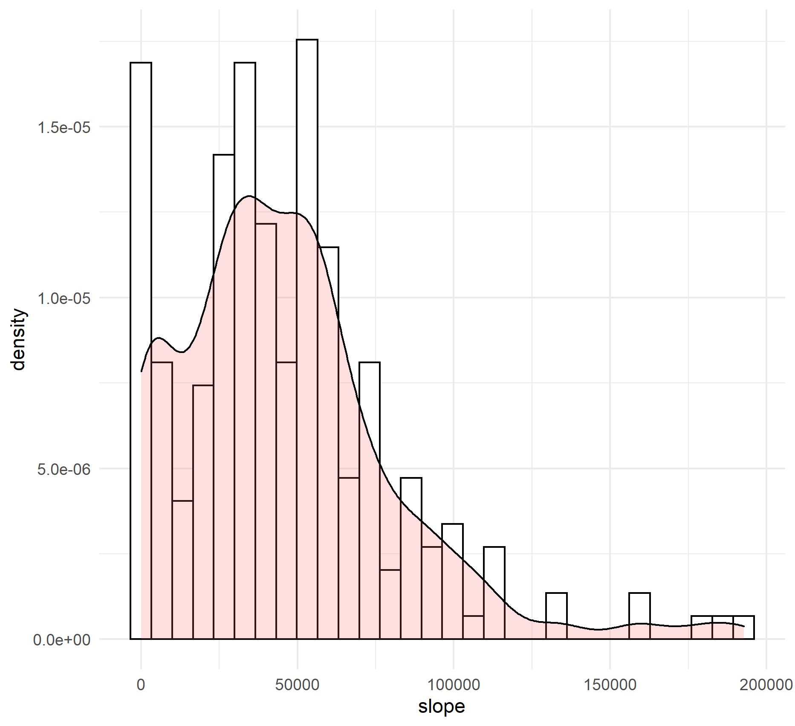
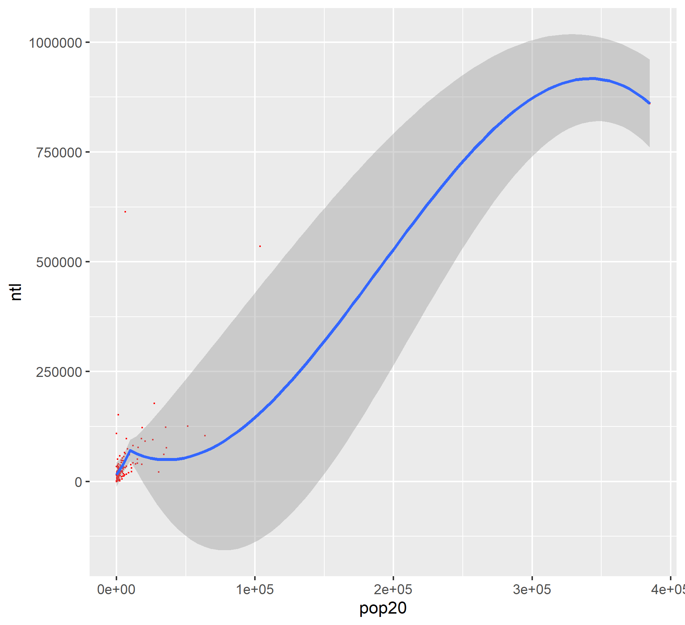
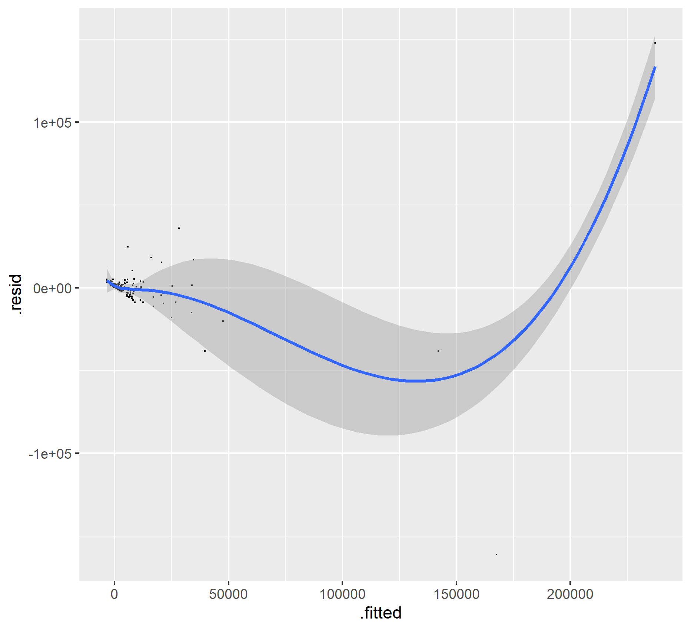
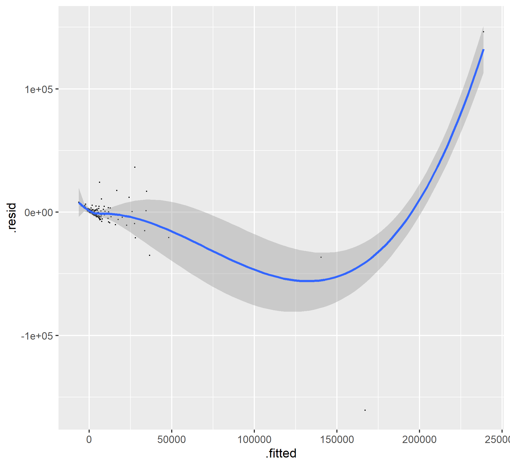

# Project 3
In this project, we obtained the land cover and land use data for a country to describe and analyze the country and modeled relationships between geospatial attributes. 

# Challenge Question 1
These are the combined histogram with density plots of Estonia. 

This is the combined histogram with density plot of night time lights versus population density.

This is the combined histogram with density plot of slope versus population density. 

# Challenge Question 2
These are the linear models describing any correlationships between population and land cover or land use data. 

This is the linear model of night time lights and population.

This is the linear model of night time lights, urban cover, bare cover, and population.

This is the linear model of all the geospatial attributes and population.

