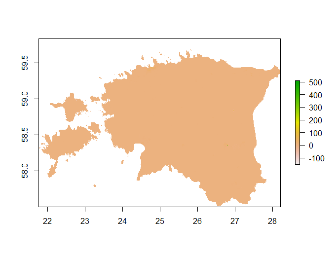

# Project 4
In this project, we predicted spatial values across our selected country and plotted our predicted populations of our selected countries. 

# Challenge Question
These are plots of predicted spatial values of two cities within Estonia at the first and second administrative levels. 
This is the plot of the Tartu County population at the first administrative level.

This is the plot of the Tartu city population at the second administrative level.

This is the plot of the Harju County population at the first administrative level.

This is the plot of the Tallinn city population at the second administrative level.

# Project 4 Part 2 Deliverables
The following are spatial plots that describe the predicted population of Estonia based on three models. 
For the following three plots, the response variable is population and the predictors are the sum of covariates.
Plot of predicted population of Estonia.

Plot of difference in the predicted population and real population of Estonia.

3D plot of the difference in predicted and real population of Estonia. 

For the following three plots, the response variable is population and the predictors are the mean of covariates.
Plot of predicted population of Estonia.

Plot of difference in the predicted population and real population of Estonia.

3D plot of the difference in predicted and real population of Estonia.

For the following three plots, the response variable is the log of population and the predictors are the mean of covariates.
Plot of predicted population of Estonia.

Plot of difference in the predicted population and real population of Estonia.

3D plot of the difference in predicted and real population of Estonia.

