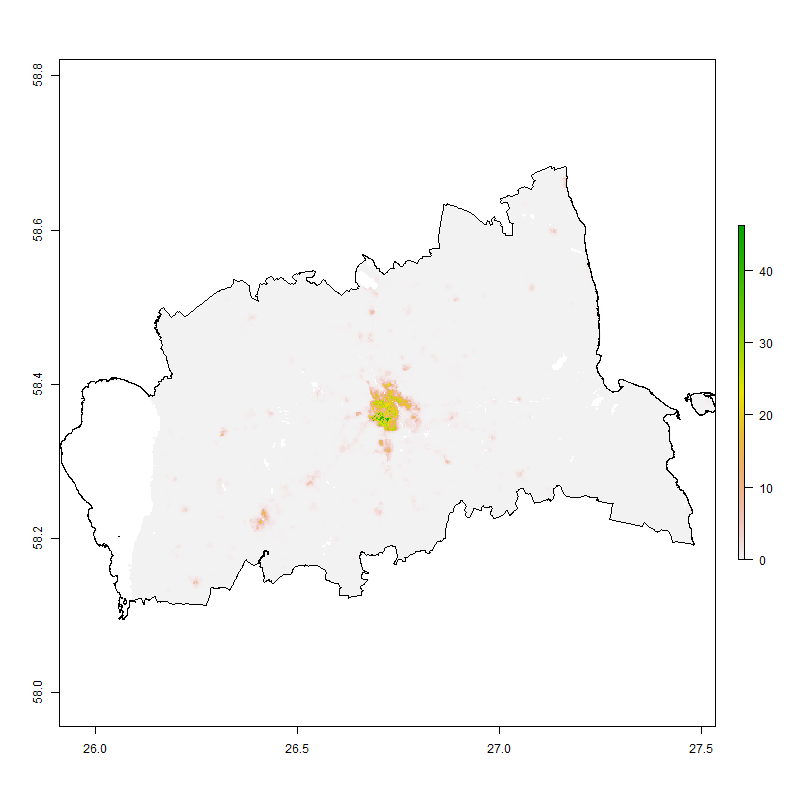
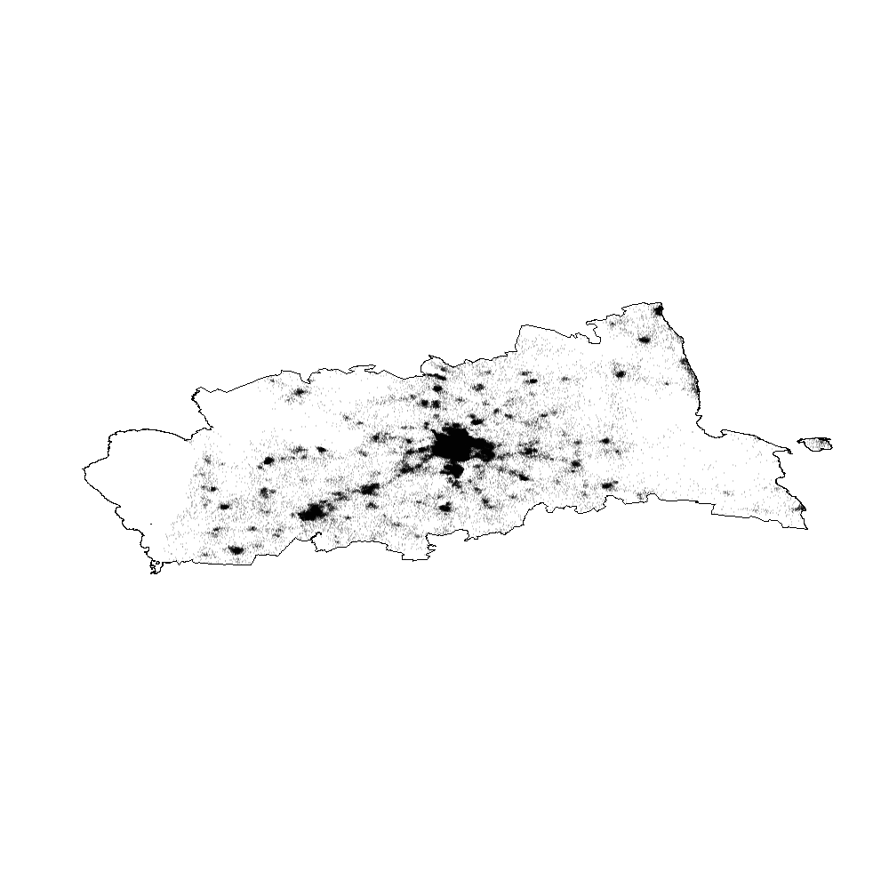
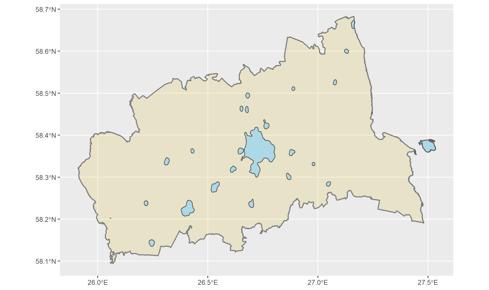
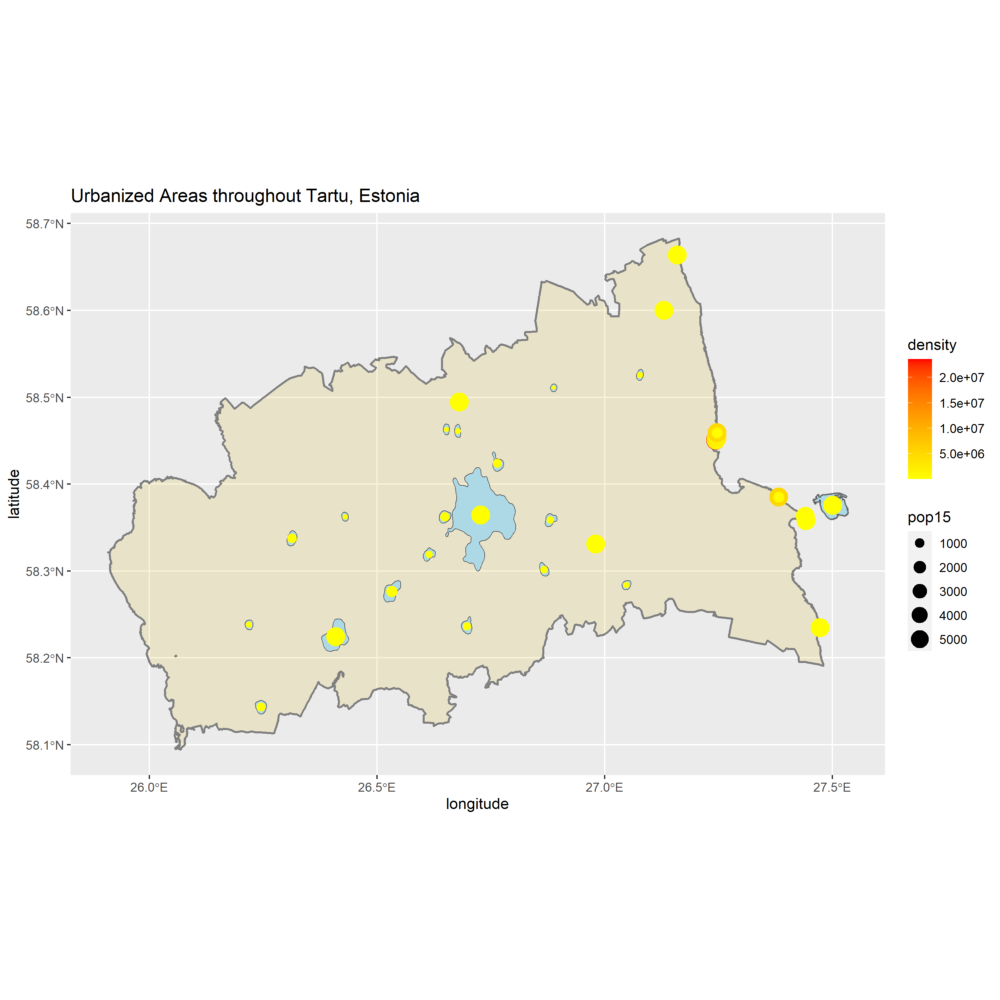
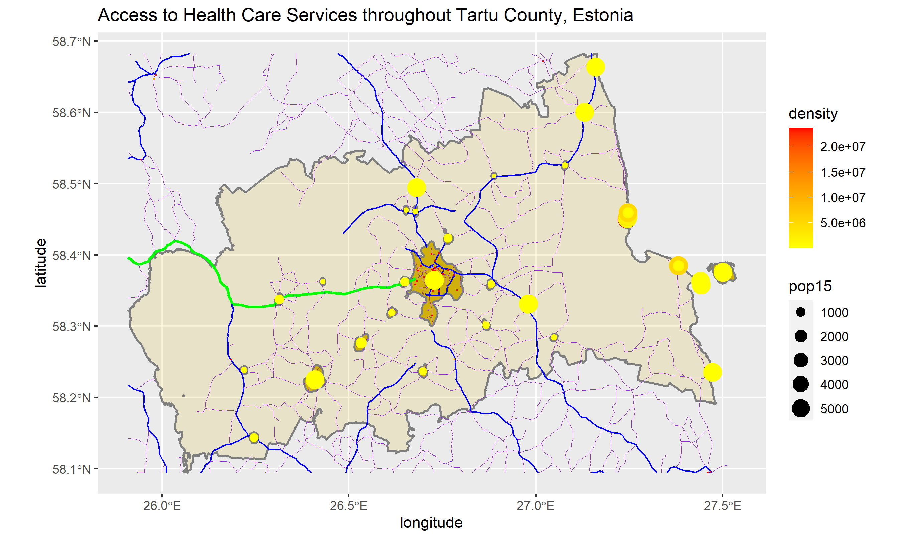

# Project 5 

# Accessibility 1
In this project, we try to distribute the population within the first administrative boundaries in Tartu county of Estonia. 

This is the cropped and masked data of the world pop person per pixel raster of Tartu County, Estonia. 

This is the probability model used to distribute the 152002 people throughout Tartu County. 

This is the plot of de facto human settlements and urban areas of Tartu County. 

This is the plot of de facto human settlements and urban areas where each area is described in terms of its population and density of Tartu County. 

# Accessibility 2
In this project, we developed a plot describing the de facto location of human settlements and urban areas, roadways, and location of health care facilities throughout Tartu County. 

The total population in Tartu County, Estonia is estimated to be 152002 people, and there are 23 distinctly defined urban areas. We can see that among the urban areas, the population size and densities are all similar and most areas are either around the geographical center of Tartu County or along the eastern border of the county. We can also see a major highway connecting the largest urban area to a neighboring county as well as smaller roads connecting all the smaller urban areas. However, we see that in areas with no distinct urban areas, we see no major roads. Finally, we also observe many health care facilities, especially pharmacies, are clustered within the largest urban area. 

# Accessibility 3
In this project, we describe the de facto location of human settlements and urban areas, roadways, and location of health care facilities throughout Tartu County with topography. 
