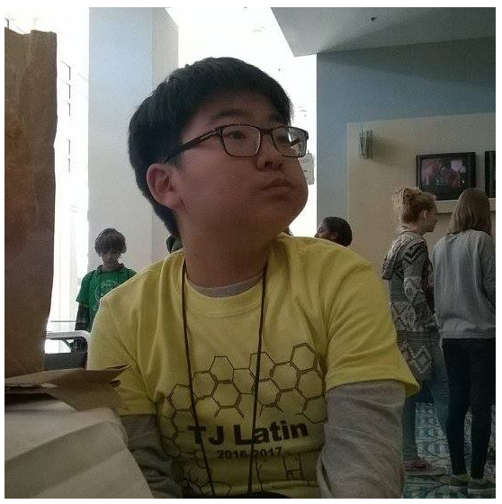

# Data100
My name is Jungmin Shin and I am a student at William and Mary taking the Data 100 course called "Wicked Problems." I am originally from Seoul, Korea but I moved to Fairfax, VA in 5th grade. At William and Mary, I am majoring in Chemistry with a concentration in Biochemistry. 

## Projects
[Getting Started with R](GettingStartedwithR.md) 

[Project 1](Project_1.md)

[Project 2.1](Project_2_1.md)

[Project 2.2](Project_2_2.md)

[Project 3](Project_3.md)

[Project 4](Project_4.md)

[Project 5](Project_5.md)

### Informal Responses
[Informal Response 1](Informal_Response_1.md)

[Informal Response 2](Informal_Response_2.md)

[Informal Response 3](Informal_Response_3.md)

[Informal Response 4](Informal_Response_4.md)

[Informal Response 5](Informal_Response_5.md)
